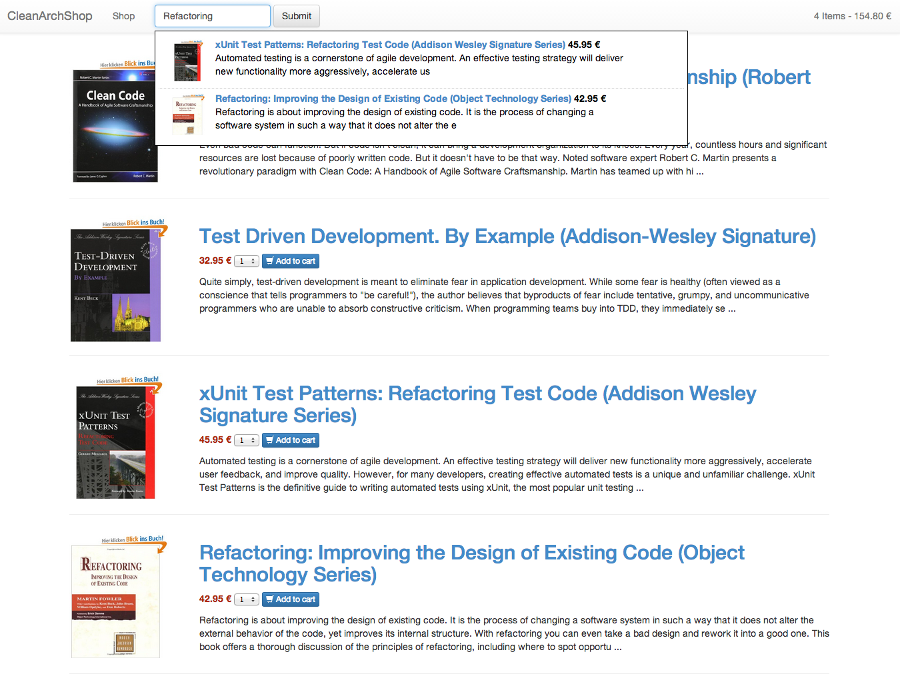
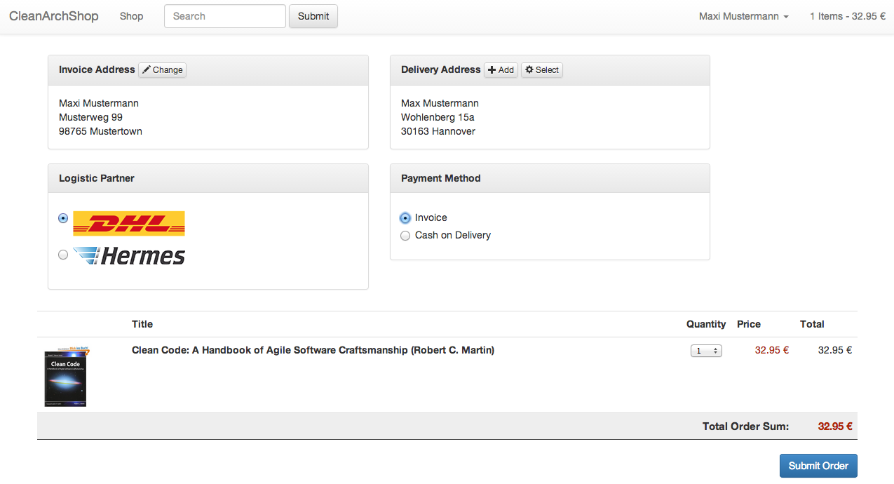

Clean Architecture Shop
==============

Playground for Uncle Bobs' Clean Architecture.

Links for Clean Architecture:
=============================

 - http://blog.8thlight.com/uncle-bob/2012/08/13/the-clean-architecture.html
 - https://www.youtube.com/watch?v=asLUTiJJqdE

Screenshots:
============

Registered Customer:
====================

Setup:
====

    git clone 
    bin/console doctrine:database:create
    bin/console doctrine:schema:create
    bower install

Include some test data:
====

Use migration/db/example_data.sql

Development:
===

If we use a VOLUME in Docker, then the vendor/ folder might disappear it the host hasn't got it.
So we need to install dependencies again.

Install dependencies with docker:

    docker run --rm -v $(pwd):/app composer/composer install --prefer-dist --ignore-platform-reqs
    docker run -it --rm -v $(pwd):/data digitallyseamless/nodejs-bower-grunt bower install

Run Selenium Tests with docker:

    docker run -d -p 4444:4444 -P --name selenium-hub selenium/hub
    docker run -d --link selenium-hub:hub selenium/node-firefox
